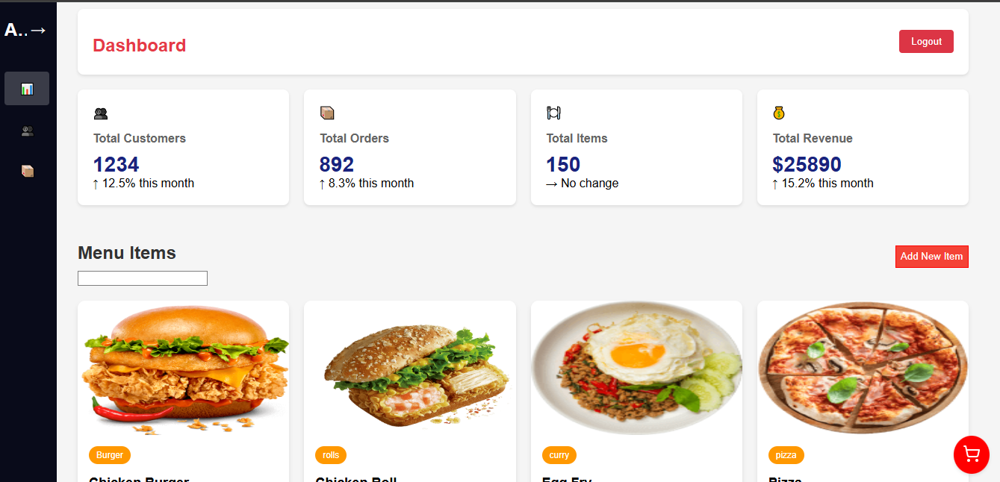
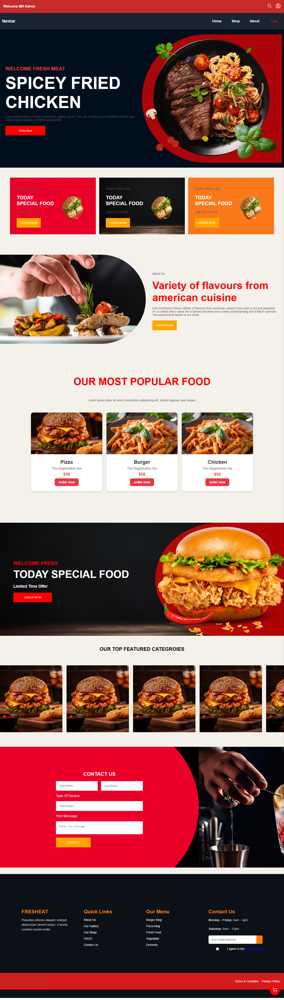
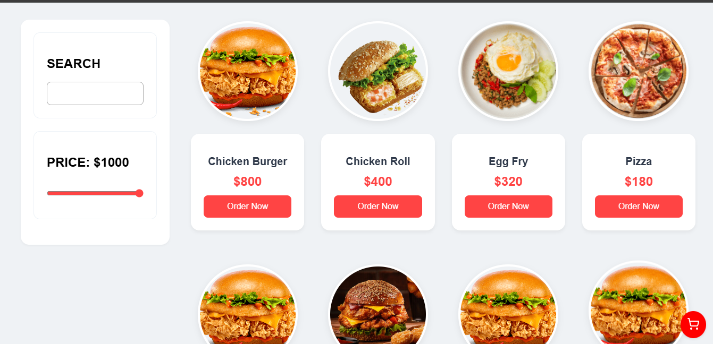

# **🍔 FoodWe - A Modern Food Ordering Website**
### **Delicious, Responsive, and Fully Functional MERN Stack Food Ordering Platform**


> **FoodWe** is a **beautiful and responsive food ordering website** where users can explore, add food items (like **pizzas, burgers, etc.**) to the cart, and place orders. It also features an **Admin Dashboard** to manage food items efficiently. Built using the **MERN stack** for a seamless experience.  

---
<div align="center">

<table>
    <tr>
    <td></td>
    <td></td>
  </tr>
  <tr>
    <td></td>
  </tr>
  <tr>
    <td></td>
  </tr>

</table>

</div>


---

## **🚀 Features**
✅ **Beautiful UI & Fully Responsive** – Works perfectly on all devices  
✅ **User-Friendly Cart & Checkout System**  
✅ **Admin Panel for Managing Food Items**  
✅ **Fast & Secure Authentication**  
✅ **MERN Stack - MongoDB, Express, React, Node.js**  
✅ **Cloudinary Image Upload for Food Items**  
✅ **Smooth Animations & Modern UI**  

---

## **🛠 Tech Stack**
| **Technology** | **Used For** |
|---------------|-------------|
| **React.js** | Frontend UI |
| **Node.js** | Backend Server |
| **Express.js** | API Development |
| **MongoDB** | Database |
| **Cloudinary** | Image Storage |
| **Context Api** | State Management |
| **CSS/CSS3** | Styling |
| **JWT Authentication** | Secure Login & Signup |

---

## **📸 Screenshots**
### 🏠 **Homepage**
  

### 🛒 **Cart Page**
  

### 📊 **Admin Dashboard**
  

---

## **🔧 Installation & Setup**
Follow these steps to run the project locally:

### **1️⃣ Clone the Repository**
```sh
git clone https://github.com/your-username/FoodWe.git
cd FoodWe
```

### **2️⃣ Install Dependencies**
```sh
# Install server dependencies
cd backend
npm install

# Install client dependencies
cd ../frontend
npm install
```

### **3️⃣ Set Up Environment Variables**
Create a `.env` file in the **backend** folder and add:
```
MONGO_URI=your_mongodb_connection_string
JWT_SECRET=your_jwt_secret
CLOUDINARY_CLOUD_NAME=your_cloud_name
CLOUDINARY_API_KEY=your_api_key
CLOUDINARY_API_SECRET=your_api_secret
```

### **4️⃣ Start the Development Server**
```sh
# Start Backend
cd backend
npm run dev

# Start Frontend
cd ../frontend
npm start
```

🚀 The project will now be running on `http://localhost:3000`  

---


## **🔒 Authentication**
- **User Login & Signup** – JWT-based authentication  
- **Admin Panel** – Secure access to manage food items  
- **Role-based Access** – Only admins can modify/delete food items  

---

## **🛍️ Order & Checkout**
- Users can **add multiple items to the cart**  
- Checkout process includes **address, payment, and order confirmation**  
- Orders are stored in the **database**  

---

## **🎨 UI & Design**
The **FoodWe** website is designed with:
- **Modern UI/UX**
- **Beautiful Animations**
- **Fully Responsive Design**
- **Smooth Transitions & Effects**  

---

## **🛠 Future Enhancements**
🔹 **Payment Gateway Integration (Stripe/PayPal)**  
🔹 **Live Order Tracking**  
🔹 **User Reviews & Ratings**  
🔹 **Wishlist Feature**  

---

## **📞 Need Help? Have Questions?**
💬 Feel free to ask! I'll answer your queries one by one.  

--- 
Project Images


---

## **📜 License**
This project is **open-source** and available under the **MIT License**.  

---


